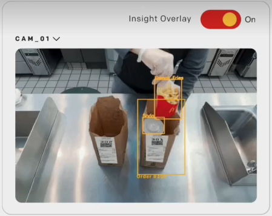
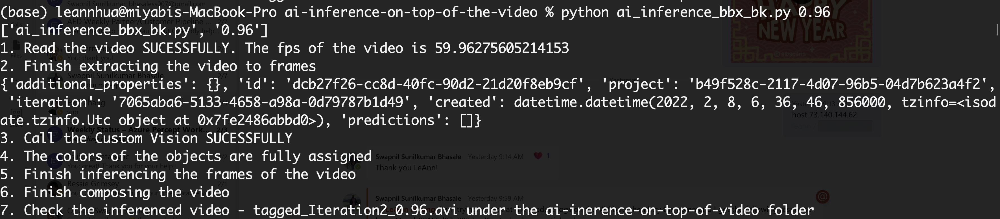

# object-detection-with-checking-bbox-overlapped
The goal of this sample code is to guide you to output a video with bbox on top of it and check if the food items and bag are overlapped by leveraging Azure Custom Vision. We assume that there are two bags in the table with the correct food items defined. 



input: video

output: inference result on top of the video

## Prerequisites
- Azure Subscription : ([Free trial account](https://azure.microsoft.com/en-us/free/))

## Steps
1. Create an object detection model as in [here](https://docs.microsoft.com/en-us/azure/cognitive-services/custom-vision-service/get-started-build-detector)
2. Reference the object you defined in custom vision and modify the objects set accordingly [here](https://github.com/leannhuang/object-detection-with-checking-bbox-overlapped/blob/main/check_bbox_overlapped.py#L27) 
3. Define the correct food items in the [bag1](https://github.com/leannhuang/object-detection-with-checking-bbox-overlapped/blob/main/check_bbox_overlapped.py#L17) and [bag2](https://github.com/leannhuang/object-detection-with-checking-bbox-overlapped/blob/main/check_bbox_overlapped.py#L18)
4. After publishing the iteration, fill in the values of `prediction_key`, `ENDPOINT`,` project_id`,`PUBLISH_ITERATION_NAME` in the custom vision credentials information block [here](https://github.com/leannhuang/object-detection-with-checking-bbox-overlapped/blob/main/check_bbox_overlapped.py#L39)
5. Put the video for inference under the object-detection-with-checking-bbox-overlapped folder, and fill in the value of the  `video_name` [here](https://github.com/leannhuang/object-detection-with-checking-bbox-overlapped/blob/main/check_bbox_overlapped.py#L48)
6. Open your terminal and type the command with the probablity threshold(first argument) like below 
```
   python ai_inference_bbx_bk.py 0.99
```
6. You will see the log below to know the current process
   1. Read the video SUCESSFULLY. The fps of the video is XX.XXXXX
   2. Finish extracting the video to frames 
   3. Call the Custom Vision api SUCESSFULLY
   4. The colors of the objects bbox are fully assigned
   5. Finish inferencing the frames of the video
   6. Finish composing the video
   7. Check the inferenced video under the ai-inerence-on-top-of-video folder

